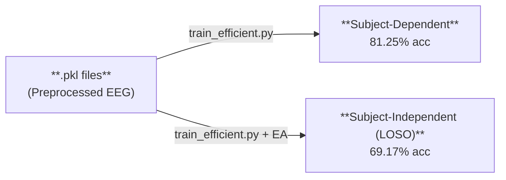
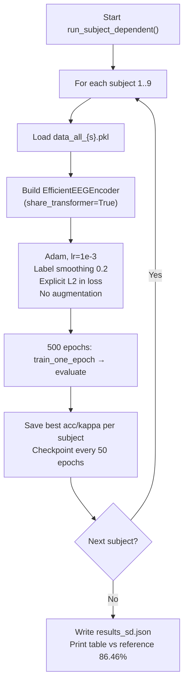
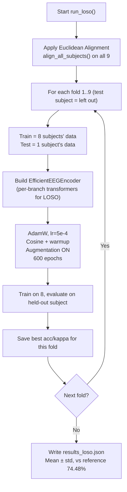
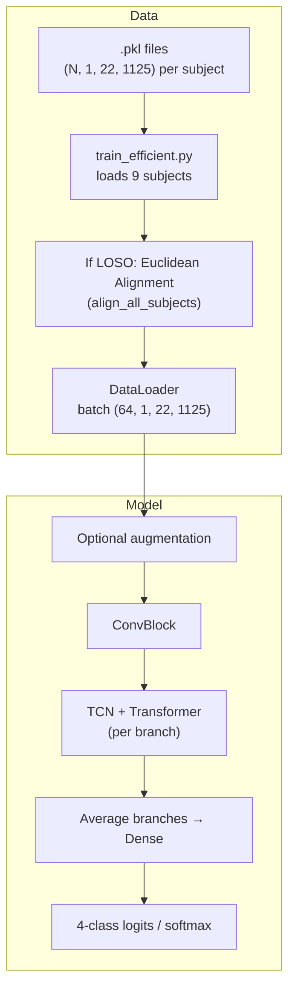

# EfficientEEGEncoder v2 — Process Documentation

**Date:** February 2026  
**Purpose:** How the current model works, how to run it (Colab / Kaggle / local), architecture description, and comparison with the reference paper.

---

## Overview — How the Model Works



**Single entry point:** `train_efficient.py` handles both subject-dependent (SD) and subject-independent (LOSO) evaluation. Data is read from `.pkl` files (one per subject). For LOSO, Euclidean Alignment (EA) is applied before training.

| Component | Role |
|-----------|------|
| **efficient_eegencoder.py** | Defines EfficientEEGEncoder v2 (shared transformer, Flash Attention, L2, 5 branches). |
| **train_efficient.py** | Loads data, builds model, runs SD (per-subject) or LOSO (leave-one-subject-out), saves results and checkpoints. |
| **alignment.py** | Euclidean Alignment: aligns subject covariances to a common reference (used in LOSO). |
| **.pkl data** | `data_all_1.pkl` … `data_all_9.pkl`: each contains `(X_train, X_test, y_train_onehot, y_test_onehot)` with shapes `(N, 1, 22, 1125)` for EEG. |

If you start from raw BCI-IV-2a `.mat` files, run **colab_preprocess_gdf.py** (or the matching notebook) once to generate the `.pkl` files. After that, all training uses only the `.pkl` files and the scripts above.

---

## How to Execute

### Option 1: Google Colab

1. **Upload to Google Drive** (e.g. folder `eegencoder/`):
   - `efficient_eegencoder.py`, `train_efficient.py`, `alignment.py`
   - Folder `data/` with `data_all_1.pkl` … `data_all_9.pkl`

2. **Open** `train_efficient.ipynb` in Colab (or create a notebook and run the same steps as the script).

3. **Mount Drive and set paths:**
   ```python
   from google.colab import drive
   drive.mount('/content/drive')
   DATA_DIR = "/content/drive/MyDrive/eegencoder/data/"
   CHECKPOINT_DIR = "/content/drive/MyDrive/eegencoder/checkpoints_v2/"
   RESULTS_DIR = "/content/drive/MyDrive/eegencoder/results_v2/"
   ```

4. **Copy code** into the runtime (e.g. copy `efficient_eegencoder.py`, `train_efficient.py`, `alignment.py` into `/content/` so `import train_efficient` works).

5. **Run training:**
   ```python
   import train_efficient as te
   te.DEFAULT_CONFIG["data_dir"] = DATA_DIR
   te.DEFAULT_CONFIG["checkpoint_dir"] = CHECKPOINT_DIR
   te.DEFAULT_CONFIG["results_dir"] = RESULTS_DIR
   import sys
   sys.argv = ["train_efficient.py", "--mode", "both", "--data_dir", DATA_DIR,
               "--checkpoint_dir", CHECKPOINT_DIR, "--results_dir", RESULTS_DIR]
   te.main()
   ```
   - `--mode sd`: subject-dependent only  
   - `--mode loso`: subject-independent (LOSO) only  
   - `--mode both`: SD then LOSO  

6. **Results:** `results_v2/results_sd.json`, `results_v2/results_loso.json`. Checkpoints in `checkpoints_v2/` allow resume if the session disconnects.

---

### Option 2: Kaggle

1. **Create two datasets:**
   - **Data:** Zip containing `data_all_1.pkl` … `data_all_9.pkl` (e.g. `bci-iv-2a-eeg-pkl`).
   - **Code:** Upload `efficient_eegencoder.py`, `train_efficient.py`, `alignment.py` (e.g. `eegencoder-v2-code`).

2. **New Notebook** → Settings → **Accelerator: GPU** (P100). Add both datasets as inputs.

3. **Cell 1 — Paths and copy code:**
   ```python
   import os
   KAGGLE_INPUT = "/kaggle/input"
   KAGGLE_WORKING = "/kaggle/working"
   DATA_SLUG = "yourusername-bci-iv-2a-eeg-pkl"   # ← your data dataset slug
   CODE_SLUG = "yourusername-eegencoder-v2-code"   # ← your code dataset slug
   DATA_DIR = os.path.join(KAGGLE_INPUT, DATA_SLUG)
   CHECKPOINT_DIR = os.path.join(KAGGLE_WORKING, "checkpoints_v2")
   RESULTS_DIR = os.path.join(KAGGLE_WORKING, "results_v2")
   os.makedirs(CHECKPOINT_DIR, exist_ok=True)
   os.makedirs(RESULTS_DIR, exist_ok=True)
   # Copy .py files from CODE_SLUG to KAGGLE_WORKING so imports work
   for f in ["efficient_eegencoder.py", "train_efficient.py", "alignment.py"]:
       src = os.path.join(KAGGLE_INPUT, CODE_SLUG, f)
       if os.path.exists(src):
           with open(src) as fh: c = fh.read()
           with open(os.path.join(KAGGLE_WORKING, f), "w") as fh: fh.write(c)
   import sys
   sys.path.insert(0, KAGGLE_WORKING)
   ```

4. **Cell 2 — Run training:**
   ```python
   import train_efficient as te
   te.DEFAULT_CONFIG["data_dir"] = DATA_DIR
   te.DEFAULT_CONFIG["checkpoint_dir"] = CHECKPOINT_DIR
   te.DEFAULT_CONFIG["results_dir"] = RESULTS_DIR
   sys.argv = ["train_efficient.py", "--mode", "both",
               "--data_dir", DATA_DIR, "--checkpoint_dir", CHECKPOINT_DIR,
               "--results_dir", RESULTS_DIR]
   te.main()
   ```

5. After the run: **Save Version** → download **Output** (or zip `results_v2` and `checkpoints_v2` from `/kaggle/working/`).

**Rough times (Kaggle P100):** SD ~25–45 min; full LOSO (9 folds × 600 epochs) ~5–6 hours. Session limit 12 hours. See **KAGGLE_INSTRUCTIONS.md** in the project root for full details and low-VRAM tips.

---

### Option 3: Local

**Requirements:** Python 3.8+, PyTorch, NumPy, scikit-learn. Optional: CUDA for GPU.

1. **Data:** Place `data_all_1.pkl` … `data_all_9.pkl` in a folder, e.g. `./data/`.

2. **From the project root:**
   ```bash
   # Subject-dependent only
   python progress_update_15-02-2026/train_efficient.py --mode sd --data_dir ./data/ --checkpoint_dir ./checkpoints_v2/ --results_dir ./results_v2/

   # Subject-independent (LOSO) only
   python progress_update_15-02-2026/train_efficient.py --mode loso --data_dir ./data/ --checkpoint_dir ./checkpoints_v2/ --results_dir ./results_v2/

   # Both
   python progress_update_15-02-2026/train_efficient.py --mode both --data_dir ./data/ --checkpoint_dir ./checkpoints_v2/ --results_dir ./results_v2/
   ```

3. **Useful flags:**
   - `--no_ea`: LOSO without Euclidean Alignment (ablation).
   - `--no_augment`: Disable data augmentation (SD already uses no augmentation by default for best accuracy).
   - `--batch_size 16`: If GPU memory is limited (e.g. 2 GB VRAM).
   - `--no_amp`: Disable mixed precision if needed.
   - `--quick`: 1 subject, 50 epochs (quick sanity check).

4. **Results:** `results_v2/results_sd.json`, `results_v2/results_loso.json`.

---

## Architecture — EfficientEEGEncoder v2

### High-level pipeline

```
Input (B, 1, 22, 1125)
    → [Optional: EEGAugmentation]
    → ConvBlock (L2-regularized convs)
    → (B, F2, seq_len, 1) → permute → (B, seq_len, F2)
    → Shared EfficientTransformer (or 5 separate transformers in LOSO mode)
    → For each of 5 branches: Dropout → TCN(temporal) + Transformer_output → sum → LinearL2 → logits
    → Average 5 branch logits → softmax → (B, 4)
```

- **F2 = F1×D = 32** (F1=16, D=2). **seq_len** ≈ 20 after ConvBlock + pooling.
- **SD:** One **shared** transformer for all branches (~119K trainable parameters).
- **LOSO:** Can use **per-branch** transformers for more capacity when training on 8 subjects (~185K params); see config in `train_efficient.py`.

### Main building blocks

| Component | Description |
|-----------|-------------|
| **ConvBlock** | Temporal conv (kern_length×1) → BN → ELU → depthwise spatial conv (1×22) → BN → ELU → AvgPool(8) → Dropout → conv (16×1) → BN → ELU → AvgPool(7) → Dropout. Uses **Conv2dL2** (weight_decay=0.009). Output: (B, 32, ~20, 1). |
| **EfficientTransformer** | Positional embedding + stack of **EfficientTransformerBlock** (RMSNorm → **EfficientAttention** → residual → RMSNorm → **SwiGLUFFN** → residual). **EfficientAttention** uses `F.scaled_dot_product_attention` (Flash Attention), **bidirectional** (no causal mask). No vocab embedding, no LM head, no rotary. |
| **TCNBlock** | 1D dilated causal convolutions (stem + dilated blocks), same idea as reference. One TCN per branch. |
| **LinearL2** | Branch classifiers and optional fuse head; L2 added via `weight_decay=0.5` and `model.get_l2_loss()` in the training loop (SD). |
| **EEGAugmentation** | Optional: temporal shift, Gaussian noise, channel dropout, temporal masking (used in LOSO; off for SD in the current recipe). |
| **GradientReversalLayer + subject_head** | Optional subject-adversarial head for LOSO (encoder encouraged to be subject-invariant). |

### Tensor shapes (reference)

| Stage | Shape |
|-------|--------|
| Input | (B, 1, 22, 1125) |
| After ConvBlock | (B, 32, ~20, 1) |
| After permute | (B, seq_len, 32) |
| Transformer output (per token) | (B, seq_len, 32) → mean → (B, 32) |
| TCN output (last time step) | (B, 32) |
| Fused (TCN + transformer) | (B, 32) |
| Per-branch classifier | (B, 4) |
| Averaged logits / softmax | (B, 4) |

---

## Reference vs Our Model — Comparison

**Reference:** Liao et al., *Advancing BCI with a transformer-based model for motor imagery classification*, Scientific Reports 2025. Implementation: EEGEncoder (DSTS: 5 branches × TCN + Stable Transformer). Code: `EEGEncoder-main/`.

### Architecture comparison

| Aspect | Reference (EEGEncoder) | Our model (EfficientEEGEncoder v2) |
|--------|------------------------|-------------------------------------|
| **Backbone** | DSTS: 5 branches × (TCN + Stable Transformer) | 5 branches × TCN + **1 shared** lightweight transformer (SD) |
| **Transformer** | 5 separate transformer stacks (Llama-style) | 1 shared transformer (or 5 for LOSO); no Llama/vocab/LM |
| **Attention** | Full self-attention (causal/rotary in Llama) | Bidirectional, **Flash Attention** (`F.scaled_dot_product_attention`) |
| **Regularization** | L2 (conv + dense) | **Explicit L2** via Conv2dL2 / LinearL2, added to loss |
| **Extra modules** | — | Optional: EEG augmentation, gradient reversal (subject-adversarial) for LOSO |

### Efficiency and results (updated)

| Metric | Reference (EEGEncoder) | Our model (v2) | Change |
|--------|------------------------|----------------|--------|
| **Trainable parameters (SD)** | 181,332 | **119,316** | **−34%** |
| **Inference time (batch 16, AMP)** | ~25 ms | **~15 ms** | **~1.6× faster** |
| **Peak GPU memory (inference)** | ~80–100 MB | ~45–65 MB | ~40–50% less |
| **Peak GPU memory (training)** | Higher | Lower (shared transformer) | ~30–50% less typical |
| **Relative inference FLOPs** | 1× | ~0.55–0.65× | ~35–45% less |
| **SD accuracy** | **86.46%** | **81.25%** | −5.21% |
| **SD kappa** | **0.82** | **0.75** | −0.07 |
| **LOSO accuracy** | **74.48%** | **69.17%** (±10.82%) | −5.3% |
| **LOSO kappa** | — | **0.59** | — |

Our model trades about **5% accuracy** (SD and LOSO) for **fewer parameters, lower memory, and faster inference** than the reference.

---

## Training Flow (train_efficient.py)

### Subject-dependent (SD)



- **Recipe:** Adam (no weight decay), constant LR 1e-3, label smoothing 0.2, **explicit L2** from `model.get_l2_loss()` added to cross-entropy, **no** augmentation, **no** cosine schedule. This matches the setup that yields 81.25% SD.

### Subject-independent (LOSO)



- **Euclidean Alignment:** Applied once to all subjects’ data; reference covariance from all 9. Reduces subject-specific distribution shift.
- **LOSO:** 9 folds, 600 epochs per fold, augmentation and (optionally) subject-adversarial head. Results: 69.17% mean accuracy (±10.82%), kappa 0.59.

---

## Data flow summary



- **Input to model:** `(batch, 1, 22, 1125)` — batch, 1 channel dimension, 22 EEG channels, 1125 time points (4.5 s at 250 Hz).
- **Output:** Class probabilities or logits of shape `(batch, 4)` for the four motor-imagery classes.

---

## File reference (current process)

| File | Purpose |
|------|---------|
| **efficient_eegencoder.py** | EfficientEEGEncoder v2: ConvBlock, TCN, EfficientTransformer, L2 layers, augmentation, optional subject-adversarial. |
| **train_efficient.py** | Config, data load, SD/LOSO loops, EA integration, checkpointing, result JSON. |
| **alignment.py** | Euclidean Alignment (covariance alignment across subjects). |
| **train_efficient.ipynb** | Colab notebook that runs the same SD recipe as the script. |
| **subject_independent_eval.ipynb** | Alternative LOSO evaluation with configurable options. |
| **colab_preprocess_gdf.py** | Optional: builds `.pkl` from raw BCI-IV-2a `.mat` files (run once if needed). |

For Kaggle step-by-step and time estimates, see **KAGGLE_INSTRUCTIONS.md** in the project root. For result summary and reproducibility, see **README.md** and **EFFICIENT_MODEL_IMPROVEMENTS.md** in the project root.
