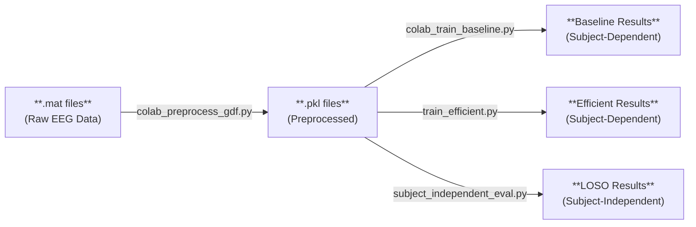
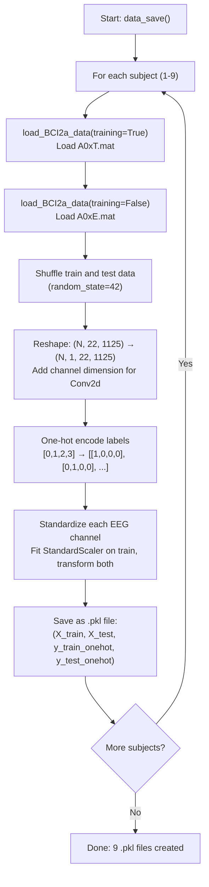
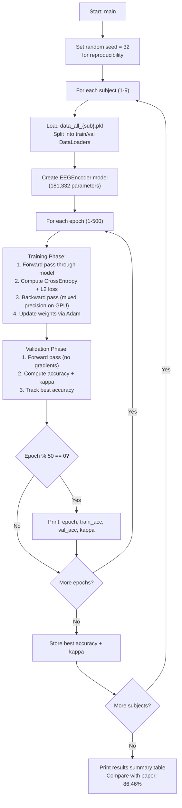
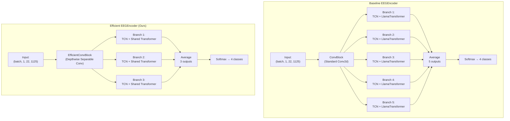
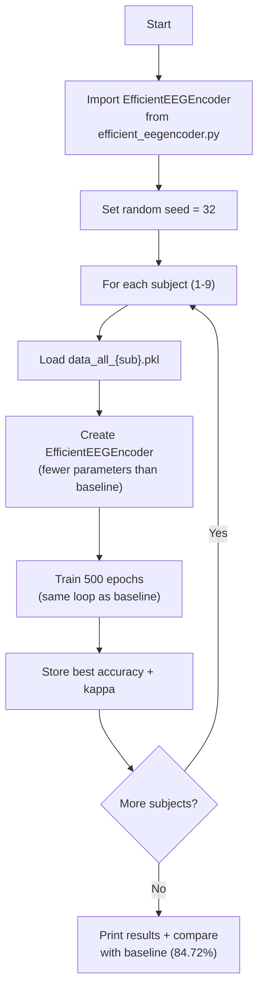
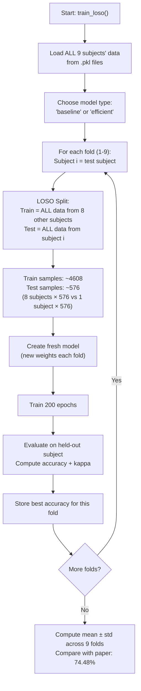
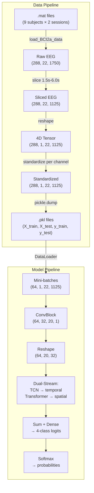

# EEGEncoder — Complete Process Documentation

**Date:** February 24, 2026  
**Purpose:** Detailed documentation of every script, what each code block does, and flowcharts showing the data and execution flow.

---

## Overview — How All Programs Connect

There are **4 main scripts**, each with a specific role:

| Script | Input | Output | Purpose |
|:--|:--|:--|:--|
| `colab_preprocess_gdf.py` | `.mat` files (raw EEG) | `.pkl` files | Convert raw data → training-ready format |
| `colab_train_baseline.py` | `.pkl` files | Accuracy & Kappa per subject | Train & evaluate baseline EEGEncoder |
| `train_efficient.py` | `.pkl` files | Accuracy & Kappa per subject | Train & evaluate efficient EEGEncoder |
| `subject_independent_eval.py` | `.pkl` files | LOSO accuracy per subject | Cross-subject generalization test |

Additionally:
| File | Role |
|:--|:--|
| `efficient_eegencoder.py` | Defines the EfficientEEGEncoder model class (imported by `train_efficient.py` and `subject_independent_eval.py`) |
| `lma.py` | Defines LlamaForCausalLM transformer (imported by `colab_train_baseline.py`) |

---

## 1. colab_preprocess_gdf.py — Data Preprocessing

### What It Does
Converts raw BCI Competition IV-2a `.mat` files into `.pkl` files ready for model training. Each `.pkl` contains train/test splits for one subject.

### Flowchart

### Code Block Breakdown

| Lines | Block | What It Does |
|:--|:--|:--|
| 18-24 | **Imports** | numpy, scipy (for .mat loading), sklearn (for standardization), pickle (for saving) |
| 26-92 | **`load_BCI2a_data()`** | Core data loading function. Opens a `.mat` file, iterates through all 6 runs × 48 trials, extracts a 7-second window of 22-channel EEG data per trial, then slices to the 1.5s–6.0s motor imagery period (1125 samples at 250Hz). Returns `data_return` (N×22×1125) and `class_return` (labels 0-3). |
| 49-52 | ├─ Parameters | 22 EEG channels, 288 trials (6 runs × 48), 7-second window at 250 Hz = 1750 samples |
| 55-57 | ├─ Time window | `t1=375` (1.5s), `t2=1500` (6.0s) — the motor imagery period within each trial |
| 62-86 | ├─ Trial loop | For each trial: get trial start time, extract EEG window, store data and label. Uses `.item()` to handle nested numpy arrays in `.mat` files |
| 88-90 | └─ Slicing | Trim to MI window `[t1:t2]` and convert labels from 1-indexed to 0-indexed |
| 95-105 | **`standardize_data()`** | Z-score normalization per channel. Fits `StandardScaler` on training data only, then transforms both train and test (prevents data leakage) |
| 108-135 | **`get_data()`** | Orchestrates loading: calls `load_BCI2a_data()` for train + test, shuffles, reshapes to 4D `(N, 1, 22, 1125)`, one-hot encodes labels, and standardizes |
| 138-165 | **`data_save()`** | Main entry point: loops over 9 subjects, calls `get_data()`, saves each as `data_all_{i}.pkl` |
| 168-182 | **`__main__`** | Sets up paths and calls `data_save()` |

---

## 2. colab_train_baseline.py — Baseline Model Training

### What It Does
Trains the original EEGEncoder model (from the paper) on each subject separately and reports accuracy + kappa.

### Flowchart

### Code Block Breakdown

| Lines | Block | What It Does |
|:--|:--|:--|
| 18-29 | **Imports** | PyTorch, pickle, sklearn metrics, transformers (for LlamaConfig) |
| 31-46 | **Configuration** | `DATA_DIR`, device selection (CUDA/CPU), hyperparameters: 500 epochs, batch 64, lr 1e-3. `QUICK_TEST` mode for debugging (1 subject, 50 epochs) |
| 48-59 | **`setup_seed()`** | Sets all random seeds for reproducibility: torch, CUDA, numpy, random, cuDNN |
| 62-83 | **`EEGDB` class** | PyTorch Dataset wrapper. Loads a `.pkl` file, selects train or val split, converts to tensors. Returns `(x, y)` pairs for DataLoader |
| 86-90 | **LlamaForCausalLM import** | Imports the Llama-based transformer from `lma.py` — this is the "Stable Transformer" used in the paper |
| 93-135 | **`LinearL2`, `Conv1dL2`, `Conv2dL2`** | Wrapper classes that add L2 regularization tracking to standard PyTorch layers. Each has a `.l2_loss()` method that computes `weight_decay × Σ(weights²)` |
| 138-169 | **`ConvBlock`** (Downsampling Projector) | First stage of EEGEncoder. Input: (batch, 1, 22, 1125). Applies: temporal Conv2d(64×1) → BN → spatial depthwise Conv2d(1×22) → BN → ELU → AvgPool(8) → Dropout → Conv2d(16×1) → BN → ELU → AvgPool(7) → Dropout. Output: (batch, 32, 20, 1) — reduces 1125 timesteps to 20 |
| 172-233 | **`TCNBlock_`** (Temporal Conv Network) | Extracts temporal features using dilated causal convolutions. Has two initial conv layers (cn1, cn2) plus dilated blocks with increasing receptive field. Uses residual connections. The input is transposed to (batch, channels, time) for 1D convolution |
| 236-302 | **`EEGEncoder`** (Main Model) | The full model. Creates: 1 ConvBlock (shared), 5 TCN branches, 5 Llama transformers, 5 dense classifiers. Forward pass: ConvBlock → for each of 5 branches: Dropout → TCN (temporal) + Transformer (spatial) → sum → Dense → average all 5 branch outputs → softmax |
| 259-272 | ├─ LlamaConfig | Configures each transformer: hidden_size=32, 2 layers, 2 attention heads, dropout=0.3 |
| 277-302 | └─ forward() | Core dual-stream logic: TCN captures local temporal patterns, Transformer captures global spatial patterns, they are summed, classified, and averaged across 5 branches |
| 310-400 | **`train_subject()`** | Complete train+eval loop for one subject. Uses Adam optimizer, CrossEntropyLoss with label smoothing 0.2, mixed precision (AMP) on GPU. Manually sums L2 losses from all layers and adds to CE loss with 2× multiplier |
| 334-335 | ├─ GradScaler | Mixed-precision training for GPU speed (FP16 forward, FP32 gradients) |
| 348-361 | ├─ Training loop | Forward → loss = CE + L2 → scale(2 × total_loss) → backward → step |
| 368-384 | └─ Validation | No gradients, compute predictions, measure time for inference speed reporting |
| 403-425 | **`__main__`** | Loops over all subjects, collects results, prints summary table |

---

## 3. efficient_eegencoder.py — Efficient Model Definition

### What It Does
Defines the `EfficientEEGEncoder` class — a lighter, faster variant of the baseline with 5 architectural modifications.

### Architecture Comparison Flowchart

### Code Block Breakdown

| Lines | Block | What It Does |
|:--|:--|:--|
| 27-31 | **Imports** | PyTorch core modules (no transformers library needed — we build our own) |
| 46-110 | **`LinearAttention`** | **Modification 1.** Replaces full O(n²) self-attention with O(n) linear attention. Uses ELU+1 as the kernel feature map: φ(x) = elu(x) + 1. Instead of computing the n×n attention matrix softmax(QKᵀ), it computes φ(Q)·(φ(K)ᵀ·V), first multiplying K and V (d×d), then Q with the result. This avoids building the large attention matrix entirely |
| 69-73 | ├─ `_elu_feature_map()` | The kernel trick: maps Q and K to non-negative space using ELU+1 |
| 94-96 | └─ Linear computation | `kv = K^T × V` (d×d), then `qkv = Q × kv` (n×d) — no n×n matrix needed |
| 116-126 | **`RMSNorm`** | Root Mean Square Layer Normalization. Kept from original — already efficient. Normalizes by RMS instead of mean+variance like LayerNorm |
| 132-145 | **`SwiGLUFFN`** | Gated feed-forward network: `output = down_proj(silu(gate(x)) * up(x))`. Uses SiLU activation (Swish) with gating. Same concept as original LlamaMLP |
| 151-183 | **`EfficientTransformerBlock`** | Replaces LlamaDecoderLayer. Pre-norm architecture: RMSNorm → LinearAttention → residual → RMSNorm → SwiGLU FFN → residual. No rotary embeddings (fixed-length EEG), no causal mask (classification, not generation) |
| 189-226 | **`EfficientTransformer`** | Replaces LlamaForCausalLM. Stack of `EfficientTransformerBlock` layers with final RMSNorm. No vocabulary embedding (continuous EEG features, not tokens). Supports gradient checkpointing to reduce memory during training |
| 239-249 | **`DepthwiseSeparableConv2d`** | **Modification 3.** Splits a standard convolution into depthwise (spatial filtering, one filter per channel) + pointwise (1×1 conv for channel mixing). Reduces parameters from F1×F2×K to F1×(K+F2) |
| 252-293 | **`EfficientConvBlock`** | Modified ConvBlock using depthwise separable convolutions for conv1 and conv2. Same structure (Conv → BN → ELU → Pool → Dropout) but fewer parameters |
| 308-341 | **`TCNBlock`** | Same temporal convolutional network as baseline. Uses standard nn.Conv1d instead of Conv1dL2 (simpler, no L2 tracking) |
| 348-464 | **`EfficientEEGEncoder`** (Main Model) | The complete efficient model. Key differences: 3 branches instead of 5, shared transformer across all branches, depthwise separable convolutions, linear attention, gradient checkpointing support |
| 374-386 | ├─ `__init__` params | `n_branches=3`, `share_transformer=True`, `use_gradient_ckpt=False` |
| 413-424 | ├─ Shared transformer | If `share_transformer=True`: creates 1 transformer used by all branches. If False: creates `n_branches` separate transformers |
| 429-464 | └─ `forward()` | ConvBlock → for each branch: dropout → TCN (temporal) + Transformer (spatial) → sum → Dense → average all branch outputs → softmax |

---

## 4. train_efficient.py — Efficient Model Training

### What It Does
Same training loop as `colab_train_baseline.py`, but uses `EfficientEEGEncoder` instead of the baseline model. No `lma.py` dependency.

### Flowchart
(Same structure as baseline training — refer to Section 2 flowchart. The only difference is the model created at the "Create model" step.)

### Key Differences from Baseline Training

| Aspect | Baseline | Efficient |
|:--|:--|:--|
| Model | `EEGEncoder()` (181K params) | `EfficientEEGEncoder()` (fewer params) |
| Dependency | Needs `lma.py` | Self-contained |
| Loss | CE + manual L2 sum | CE only (no L2 wrappers) |
| Everything else | Same | Same |

---

## 5. subject_independent_eval.py — LOSO Evaluation

### What It Does
Tests how well a model works on a **completely unseen subject**. Uses Leave-One-Subject-Out (LOSO) cross-validation: train on 8 subjects, test on the 9th, repeat for all 9.

### Flowchart

### Code Block Breakdown

| Lines | Block | What It Does |
|:--|:--|:--|
| 16-25 | **Imports** | PyTorch, numpy, pickle, sklearn metrics, argparse |
| 28-35 | **Configuration** | DATA_DIR, 200 epochs (fewer since more training data), batch 64, lr 1e-3 |
| 39-56 | **`load_all_subjects()`** | Loads all 9 `.pkl` files. Returns 4 lists: `all_train`, `all_test`, `all_train_labels`, `all_test_labels` — each containing 9 arrays |
| 59-69 | **`CombinedDataset`** | PyTorch Dataset that concatenates data from multiple subjects into one big tensor. Used to merge 8 subjects' data for training |
| 72-96 | **`loso_split()`** | The LOSO logic. For each fold: the test subject's ALL data (train+test sessions = 576 trials) becomes the test set. All other subjects' ALL data (8 × 576 = 4608 trials) becomes the training set. This is a true subject-independent evaluation — the model never sees ANY data from the test subject during training |
| 100-218 | **`train_loso()`** | Main training loop. For each of 9 folds: creates fresh model → trains for 200 epochs → evaluates every 25 epochs → stores best accuracy and kappa |
| 126-135 | ├─ Model selection | If `--model efficient`: imports `EfficientEEGEncoder`. If `--model baseline`: imports `EEGEncoder` from baseline script (needs `lma.py`) |
| 200-217 | └─ Summary | Computes mean accuracy ± standard deviation across all 9 folds. Compares with paper's subject-independent result (74.48%) |
| 221-229 | **`__main__`** | Parses `--model` argument and calls `train_loso()` |

### Why LOSO Matters

In a real-world BCI, you can't collect calibration data from every new user. LOSO tests whether the model learned **general brain patterns** vs just **memorizing one person's EEG**. Lower accuracy than subject-dependent is expected, but a good model should still perform well.

---

## Data Flow Summary

### Tensor Shape at Each Stage

| Stage | Shape | Meaning |
|:--|:--|:--|
| Raw .mat | `(288, 22, 1750)` | 288 trials, 22 channels, 7s at 250Hz |
| After slicing | `(288, 22, 1125)` | 288 trials, 22 channels, 4.5s MI window |
| After reshape | `(288, 1, 22, 1125)` | Added dim for Conv2d input |
| After ConvBlock | `(batch, 32, 20, 1)` | 32 features, 20 timesteps (downsampled) |
| After permute | `(batch, 20, 32)` | Sequence format for TCN + Transformer |
| TCN output | `(batch, 32)` | Last timestep features |
| Transformer output | `(batch, 32)` | Mean pooled features |
| Fused | `(batch, 32)` | TCN + Transformer summed |
| Dense output | `(batch, 4)` | 4-class logits |
| Softmax | `(batch, 4)` | Class probabilities (sum = 1) |
